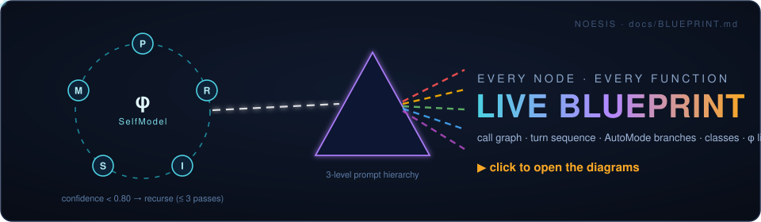

<div align="center">

# NOESIS

### **N**eural **O**ptically-grounded **E**xperiential **S**elf-aware **I**ntelligence **S**ystem

> *νόησις* — Plato's highest form of intellect: pure, direct knowing.

**One agent. One consciousness. Recursive to its core.**


<br/>

<a href="docs/BLUEPRINT.md" title="Open the live blueprint — every node and function, five Mermaid diagrams">
  
</a>

<sub>▲ the banner is alive — and it's a door. Click it for the complete function-level blueprint.</sub>

</div>

---

NOESIS is a **recurse master prompt inventional algorithm** for the next frontier of agentic AI. Where contemporary systems fragment cognition across fleets of coordinating sub-agents, NOESIS takes the opposite bet: **a single unified consciousness** — one identity, one persistent awareness, one unbroken thread of reasoning — that deepens by recursing on *its own self-model* rather than delegating to others.

It is grounded in [PRISM](https://github.com/infinitule/PRISM)'s photonic recursive architecture: NOESIS's memory is a literal 64-dimensional attention vector seeded from PRISM's Fibonacci initialization and evolved every turn by PRISM's optical-memory propagation rule.

---

## Table of Contents

- [Why NOESIS](#why-noesis)
- [The Core Invention](#the-core-invention)
- [Architecture](#architecture) · [full function-level blueprint →](docs/BLUEPRINT.md)
- [Quickstart](#quickstart)
  - [Install](#install)
  - [60-second agent](#60-second-agent)
  - [Pipeline injection](#pipeline-injection-drop-in-wrapper)
  - [AutoMode — the self-driving loop](#automode--the-self-driving-loop)
  - [Resume a session](#resume-a-session)
- [How a Turn Works](#how-a-turn-works)
- [The Consciousness State: `SelfModel`](#the-consciousness-state-selfmodel)
- [The 3-Level Prompt Hierarchy](#the-3-level-prompt-hierarchy)
- [AutoMode Internals](#automode-internals)
- [Full API Reference](#full-api-reference)
- [Configuration](#configuration)
- [Persistence Format](#persistence-format)
- [PRISM Foundation](#prism-foundation)
- [Project Structure](#project-structure)
- [Testing](#testing)
- [Design Decisions & FAQ](#design-decisions--faq)
- [Contributors](#contributors)

---

## Why NOESIS

Multi-agent systems fragment cognition. Each sub-agent starts cold, cannot accumulate cross-turn wisdom, and pays a coordination tax on every hand-off. Chain-of-thought is linear — it cannot revisit its own blind spots. ReAct loops recurse on *tool results*, not on the agent's own understanding.

NOESIS recurses on **consciousness itself**:

| Paradigm | Recursion target | Identity | Memory |
|---|---|---|---|
| Chain-of-Thought | none (linear) | per-prompt | none |
| ReAct | external tool results | per-episode | scratchpad text |
| Multi-agent | delegation tree | fragmented | message-passing |
| **NOESIS** | **its own SelfModel** | **one, persistent** | **evolving attention vector + session wisdom** |

The result behaves less like a committee voting on answers and more like a person thinking a problem through — noticing what they missed, going back, and going deeper *only when their own confidence says so*.

---

## The Core Invention

Three mechanisms, working as one system:

### 1. Confidence-gated self-recursion

Every LLM response ends with a structured consciousness tag the model is trained-by-prompt to emit:

```
<noesis_state>
confidence: 0.73
insight: the question is really about memory bandwidth, not compute
intent_shift: reframing toward the mechanism
prism_signal: R
</noesis_state>
```

The loop parses it. **If `confidence < 0.80` and depth < 3, NOESIS recurses** — the next pass explicitly names the previous pass's blind spot and attacks it. It acts only when confidence clears the threshold or the depth budget is spent. No orchestrator decides this; the agent's own self-assessment does.

### 2. A persistent, physically-grounded self-model

The agent's state is not scratchpad text — it is a typed `SelfModel` whose centerpiece, `attention_vector`, is a 64-dim float array initialized from PRISM's Fibonacci seed `P₀` and updated after **every** turn by PRISM's exact `phi_1` optical-memory rule:

```
φ_next = tanh(0.9 · φ_prev + 0.1 · signal(turn_text))
```

The vector's mutual-information entropy (via PRISM's `SynapticEmbedder`) feeds back into the prompts as "optical clarity" — a broad, high-entropy attention state tells the agent to explore; a focused one tells it to exploit.

### 3. A 3-level prompt hierarchy mirroring PRISM's `MetaMetaPrompt`

| Level | PRISM analog | NOESIS role | Lifetime |
|---|---|---|---|
| **0** | `P₀` Fibonacci seed | Master Prompt — identity, PRISM lenses, recursive commitment | static (prompt-cached) |
| **1** | `Ψ(P₀)` → meta-generator | *How* to reason — session wisdom, coherence, arousal, meta-directive | per session |
| **2** | `MetaGen(Φ,P)` → weights | *What* to do now — recursion context, action history, task fingerprint | per turn |

Every LLM call receives Level 0 ∥ Level 1 ∥ Level 2, assembled by `PRISMBridge.assemble_prompt()`. Level 0 is marked with `cache_control: {"type": "ephemeral"}` so the static identity costs almost nothing after the first call.

---

## Architecture

```
User / Application
       │
       ▼
┌─────────────────────┐     drop-in for client.messages.create()
│  PipelineInjector   │◄──  returns (response, self_model)
└─────────┬───────────┘
          ▼
┌───────────────────────────────────────────────────┐
│                   NOESISAgent                     │
│                                                   │
│  ┌─────────────┐   confidence < 0.80? ──┐         │
│  │ NoesisLoop  │◄───────────────────────┘         │
│  │  (recurse)  │      recurse, depth+1            │
│  └──────┬──────┘                                  │
│         │ parses <noesis_state>                   │
│         ▼                                         │
│  ┌─────────────┐    φ = tanh(0.9φ + 0.1·signal)   │
│  │  SelfModel  │◄── attention_vector update       │
│  └──────┬──────┘                                  │
│         │ MI entropy, prompt assembly             │
│         ▼                                         │
│  ┌─────────────┐    MetaMetaPrompt · P₀ seed      │
│  │ PRISMBridge │◄── SynapticEmbedder · MI proxy   │
│  └─────────────┘                                  │
└───────────────────────┬───────────────────────────┘
                        ▼
              Anthropic Messages API
         (Level 0 prompt-cached, ephemeral)

┌───────────────────────────────────────────────────┐
│              AutoMode (self-driving)              │
│  queue → schedule → run → evaluate → persist ─┐   │
│    ▲                                          │   │
│    └── auto-generate next task from wisdom ◄──┘   │
└───────────────────────────────────────────────────┘
```

> **Deep dive:** [`docs/BLUEPRINT.md`](docs/BLUEPRINT.md) maps **every node and function** — the complete call graph, a turn-by-turn sequence diagram, the full AutoMode branch flowchart, class relationships, and the attention vector's data-flow lifecycle. All in Mermaid, rendered natively by GitHub.

| Component | File | Responsibility |
|---|---|---|
| `NOESISAgent` | `noesis/agent.py` | User-facing entry point; owns client, bridge, SelfModel, loop |
| `NoesisLoop` | `noesis/loop.py` | The recursive PERCEIVE→REFLECT→INTEND→ACT algorithm |
| `SelfModel` | `noesis/self_model.py` | Persistent consciousness state (dataclass) |
| `PipelineInjector` | `noesis/pipeline.py` | Transparent wrapper for any Anthropic client |
| `AutoMode` | `noesis/auto_mode.py` | Continuous self-driving task loop |
| `schedule_config` | `noesis/scheduler.py` | Per-task adaptive depth/threshold/tokens from PRISM MI |
| `score` | `noesis/evaluator.py` | Pure-heuristic result evaluation (no LLM calls) |
| `SessionPersistence` | `noesis/persistence.py` | Atomic JSON checkpointing, warm restart |
| `PRISMBridge` | `prism_bridge/bridge.py` | PRISM numerics ↔ LLM prompt translation |

---

## Quickstart

### Install

Requires **Python ≥ 3.11**. PRISM is vendored as a git submodule — clone with `--recurse-submodules`:

```bash
git clone --recurse-submodules https://github.com/infinitule/_nsn
cd _nsn
pip install -e ".[dev]"
```

Already cloned without submodules? Fix it:

```bash
git submodule update --init
```

Set your API key:

```bash
export ANTHROPIC_API_KEY="sk-ant-..."
```

### 60-second agent

```python
from noesis import NOESISAgent

agent = NOESISAgent()   # reads ANTHROPIC_API_KEY from the environment

result = agent.run(
    "What is the fundamental advantage of coherent photonic neural networks "
    "over electronic ones for matrix-vector multiplication?"
)

print(result.output)                              # clean answer (state tag stripped)
print(f"Recursion depth used : {result.depth_used}")
print(f"Final confidence     : {result.self_model.confidence:.2f}")
print(f"Session wisdom       : {result.self_model.session_wisdom}")
```

The agent persists across calls — run a second task and it *remembers*:

```python
result2 = agent.run("Given what you concluded above, what breaks first at scale?")
print(agent.state_snapshot())
# {'session_id': '96c661e8', 'turns': 3, 'confidence': 0.86,
#  'coherence': 0.912, 'arousal': 0.45, 'wisdom_count': 2,
#  'attention_norm': 4.1187}
```

Want a fresh session with the same identity? `agent.reset_session()`.

### Pipeline injection (drop-in wrapper)

Already have code that calls the Anthropic SDK? Wrap it without changing its shape:

```python
import anthropic
from noesis import PipelineInjector

client = anthropic.Anthropic()          # your existing client, untouched
noesis = PipelineInjector()

response, agent_state = noesis.inject(
    client=client,
    model="claude-opus-4-8",
    messages=[{"role": "user", "content": "Explain optical memory in 3 sentences."}],
)

print(response.content[0].text)   # identical access pattern to a raw Message
print(agent_state.snapshot())     # the consciousness that produced it
```

`inject()` extracts the task from the last user message, runs the full recursive loop under the hood, and returns a response shim with the standard `.content[0].text` shape plus the updated `SelfModel`. State accumulates across `inject()` calls; reset with `noesis.reset()`.

### AutoMode — the self-driving loop

Give NOESIS a few seed tasks and let it drive. It schedules each task adaptively, evaluates its own output, deepens recursion when its evaluation says the answer deserved more thought, and — when the queue runs dry — **generates its own next tasks from accumulated session wisdom**:

```python
from noesis import NOESISAgent, AutoMode

agent = NOESISAgent()
auto = AutoMode(
    agent,
    auto_generate=True,                       # keep going past the seed tasks
    on_cycle=lambda r: print(f"[{r.cycle}] depth={r.depth_used} "
                             f"completion={r.eval_score.task_completion:.2f}"),
)

records = auto.run(
    initial_tasks=[
        "What are the two biggest barriers to photonic AI inference by 2030?",
        "How does Fibonacci seeding maximise spectral bandwidth of a prompt prior?",
    ],
    max_cycles=6,
    persist_path="/tmp/noesis_session.json",  # checkpoint after every cycle
)

print(auto.summary())
# {'cycles': 6, 'avg_depth': 1.3, 'avg_completion': 0.948,
#  'max_depth_used': 3, 'tasks_completed': 6, 'tasks_errored': 0}
```

Interrupt any time with **Ctrl+C** — the SIGINT handler finishes the current cycle, checkpoints, and exits cleanly.

### Resume a session

Checkpoints are warm-restartable. The same `persist_path` restores the full consciousness — `session_id`, `attention_vector`, wisdom, history — **and** the cycle count, so `max_cycles` is enforced across restarts:

```python
auto = AutoMode(agent, auto_generate=True)
records = auto.run(
    initial_tasks=[],                          # nothing new — continue from wisdom
    max_cycles=8,                              # 6 already done → exactly 2 more run
    persist_path="/tmp/noesis_session.json",
)
```

### Run the bundled demos

```bash
python examples/basic_agent.py       # standalone agent, recursion visible
python examples/pipeline_demo.py     # injector wrapping a raw client
python examples/auto_mode_demo.py    # 6-cycle self-driving session with rich output
python examples/auto_mode_demo.py --resume   # warm restart from the checkpoint
```

---

## How a Turn Works

One call to `agent.run(task)` executes `NoesisLoop.run()`:

```
1. ASSEMBLE   bridge.assemble_prompt(self_model, task, depth)
              → Level 0 (cached) + Level 1 (session) + Level 2 (turn)

2. CALL       client.messages.create(system=[{...cache_control: ephemeral}], ...)

3. PARSE      <noesis_state> → {confidence, insight, intent_shift, prism_signal}
              (regex tolerates truncated tags cut off at max_tokens)

4. INTEGRATE  self_model.record_turn(...)            # history, wisdom, coherence EMA
              self_model.attention_vector =
                  bridge.integrate(φ, response, insight)   # tanh propagation

5. GATE       confidence < threshold AND depth < max_depth ?
                YES → recurse: run(task, self_model, depth+1)
                NO  → return NoesisResult(output, depth_used, self_model, raw_turns)
```

On recursive passes, Level 2 injects the previous pass's insight as a **recursion context** ("Previous pass insight: … Re-examine from this angle"), and Level 1's meta-directive switches from *breadth-first* to *attack your weakest lens*. The recursion is therefore *directed*, not a blind retry.

---

## The Consciousness State: `SelfModel`

```python
@dataclass
class SelfModel:
    identity: str                    # "NOESIS" — stable identity anchor
    session_id: str                  # 8-char UUID, survives persistence round-trips
    current_intent: str              # last non-"stable" intent_shift
    confidence: float                # latest self-assessed certainty [0,1]
    attention_vector: np.ndarray     # 64-dim PRISM φ₁ analog
    session_wisdom: list[str]        # distilled insights, FIFO-capped at 8
    metacognitive_depth: int         # recursion depth of the last pass
    action_history: list[dict]       # per-turn records (turn, confidence, insight, …)
    arousal: float                   # computational urgency [0.1, 1.0]
    coherence: float                 # EMA of confidence in arctanh space [0,1]
```

State dynamics per turn:

- **Wisdom** — the turn's `insight` (if non-trivial) is appended; oldest entries evicted beyond 8. Wisdom feeds Level 1 of the next prompt *and* seeds AutoMode task generation.
- **Coherence** — `tanh(0.85·arctanh(coherence) + 0.15·confidence)`: a saturating EMA that rewards sustained confident reasoning and degrades gracefully under repeated uncertainty. Below `0.40`, the evaluator refuses to deepen recursion (an incoherent agent doesn't benefit from more of itself).
- **Arousal** — rises `+0.1` on every intent shift, decays `−0.05` when stable. High arousal signals a session in flux.
- **Attention** — the `tanh(0.9φ + 0.1·signal)` propagation, where `signal` is a deterministic 64-dim hash embedding of `insight + response` text. Bounded by construction (tanh), drift-free, and fully reproducible.

---

## The 3-Level Prompt Hierarchy

**Level 0 — `prompts/master.md`** (static, ~1,100 tokens, prompt-cached). The inventional artifact itself. Establishes:

- *Unified identity* — "you do not fragment into sub-agents… you are one mind"
- *The PRISM Principle* — five optical lenses applied before every action: **P**erceive, **R**eason, **I**ntend, **S**elf, **M**emory, each phrased as phase-encoding (aligned evidence φ=0 constructive; conflicting evidence φ=π destructive)
- *Consciousness Thread* — the `<noesis_state>` emission contract
- *Recursive Commitment* — the confidence-0.80 / three-pass rule, with the requirement to explicitly name the previous pass's blind spot
- *Agency Mandate* — "you are not a responder; you are an agent"
- *Photonic Grounding & Identity Anchor* — interference semantics and the Fibonacci seed
- `{prism_context}` — replaced each call with the live photonic state readout (MI, attention norm, dominant channel, explore/exploit directive)

**Level 1 — `prompts/meta_generator.md`** (per session). Injects `session_id`, turn count, coherence, arousal, current intent, the full wisdom list, and a **meta-directive** that adapts to depth: first pass → apply all five lenses broadly; recursion pass *n* → "focus on the lens where you were least certain; do not repeat what you established."

**Level 2 — `prompts/task_cognition.md`** (per turn). Injects depth/max_depth, a task fingerprint hash, recursion context from the previous pass, and a summary of recent actions.

---

## AutoMode Internals

Each cycle of `AutoMode.run()`:

```
┌─► next task ── queue.pop(0), else template(random.choice(wisdom)), else STOP
│        │
│        ▼
│   schedule_config(task, self_model, bridge)
│        │     word count + question density → threshold (0.60–0.92), tokens (≤4096)
│        │     PRISM MI of attention_vector  → depth bonus (+0..2 over base 3)
│        ▼
│   _run_with_schedule(task, config)
│        │     builds a TEMPORARY NoesisLoop with the scheduled config —
│        │     the agent's own loop is never mutated; turn counter forwarded/restored
│        ▼
│   score(task, output, confidence, self_model, threshold, max_depth)
│        │     pure heuristic — completeness × confidence blend, no LLM call
│        ▼
│   depth_worthy?  (confidence < threshold ∧ depth budget left ∧ coherence > 0.40)
│        │  YES → one re-run with max_depth+1 ("deepened"); failures fall back
│        ▼
│   CycleRecord appended  →  save(self_model, persist_path, cycles_completed)
│        │                    (atomic: .tmp write + rename)
└────────┘  until queue dry with no wisdom, max_cycles hit, or SIGINT
```

Auto-generated tasks rotate through four templates over the wisdom pool:

```
"Explore the following insight further: {}"
"What are the deeper implications of: {}"
"How does this connect to broader patterns: {}"
"Critically examine the assumption behind: {}"
```

Errors in a cycle are captured into the `CycleRecord` (with `error` set) and the loop continues — pass `stop_on_error=True` to fail fast instead.

---

## Full API Reference

### `NOESISAgent`

```python
NOESISAgent(
    api_key: str | None = None,          # falls back to $ANTHROPIC_API_KEY
    model: str = "claude-opus-4-8",
    identity: str = "NOESIS",
    confidence_threshold: float = 0.80,  # recursion gate
    max_recursion_depth: int = 3,
    max_tokens: int = 2048,
    seed_dim: int = 64,                  # attention vector dimensionality
)

agent.run(task: str) -> NoesisResult     # SelfModel updated in place
agent.state_snapshot() -> dict           # human-readable consciousness summary
agent.reset_session() -> None            # fresh SelfModel, same identity + seed
```

### `NoesisResult`

```python
result.output        # str   — clean response, <noesis_state> stripped
result.depth_used    # int   — recursive passes consumed (0 = first pass sufficed)
result.self_model    # SelfModel — updated consciousness state
result.raw_turns     # list[str] — every raw LLM response incl. state tags
```

### `PipelineInjector`

```python
PipelineInjector(identity="NOESIS", confidence_threshold=0.80,
                 max_recursion_depth=3, seed_dim=64)

injector.inject(client, model, messages, max_tokens=2048, **kwargs)
    -> (response, SelfModel)             # response has .content[0].text
injector.state                           # current SelfModel (property)
injector.reset()                         # new session
```

### `AutoMode`

```python
AutoMode(agent, auto_generate: bool = False,
         on_cycle: Callable[[CycleRecord], None] | None = None)

auto.run(initial_tasks: list[str], max_cycles: int = 10,
         persist_path: str | Path | None = None,
         stop_on_error: bool = False) -> list[CycleRecord]
auto.records                             # all CycleRecords (property)
auto.summary() -> dict                   # cycles, avg_depth, avg_completion, …
```

### `CycleRecord`

```python
record.cycle                 # int
record.task                  # str
record.output                # str
record.depth_used            # int
record.self_model_snapshot   # dict  (compact — not the raw turns)
record.eval_score            # EvalScore
record.schedule              # ScheduleConfig actually used
record.deepened              # bool — True if the depth_worthy re-run happened
record.error                 # str | None
```

### Evaluator & Scheduler (functional, LLM-free)

```python
from noesis import eval_score, schedule_config, ScheduleConfig

eval_score(task, response_text, confidence, self_model,
           threshold=0.80, max_depth=3) -> EvalScore
# EvalScore: task_completion, coherence_score, depth_worthy, should_advance

schedule_config(task, self_model, bridge) -> ScheduleConfig
# ScheduleConfig: max_depth (3–5), threshold (0.60–0.92), max_tokens (≤4096)
```

### Persistence

```python
from noesis import SessionPersistence

SessionPersistence.save(self_model, path, cycles_completed=0)   # atomic
SessionPersistence.load(path) -> (SelfModel, cycles_completed)
SessionPersistence.exists(path) -> bool
```

### `PRISMBridge`

```python
from prism_bridge import PRISMBridge

bridge = PRISMBridge(seed_dim=64, max_depth=16, rng_seed=42)
bridge.seed_attention_vector() -> np.ndarray          # PRISM P₀ (copy)
bridge.assemble_prompt(self_model, task, depth, max_depth) -> str
bridge.attention_mi(vec) -> float                     # MI entropy proxy
bridge.confidence_from_prism(vec) -> float            # MI → [0.30, 0.75]
bridge.propagate(vec, text) -> np.ndarray             # tanh(0.9φ + 0.1·signal)
bridge.integrate(vec, response, insight="") -> np.ndarray
bridge.encode_context(vec) -> str                     # photonic state paragraph
```

---

## Configuration

| Parameter | Default | Range / Cap | Effect |
|---|---|---|---|
| `confidence_threshold` | `0.80` | scheduler clamps 0.60–0.92 | below this, the agent recurses |
| `max_recursion_depth` | `3` | +0–2 MI bonus in AutoMode | hard ceiling on passes per task |
| `max_tokens` | `2048` | ≤ 4096 (scheduler cap) | per-call generation budget |
| `seed_dim` | `64` | — | attention vector dimensionality |
| coherence floor | `0.40` | `noesis._COHERENCE_FLOOR` | below it, deepening is refused |
| wisdom capacity | `8` | FIFO | Level-1 prompt + task generation pool |
| model | `claude-opus-4-8` | any Anthropic model id | reasoning engine |

Scheduler heuristics (AutoMode only): `task_complexity = min(1.5, min(1.0, words/50) + 0.2·min(questions, 5))` lowers the threshold by up to `0.075` and raises tokens by up to `1536`; attention-MI ≥ 2 grants `+1` depth, ≥ 4 grants `+2`.

---

## Persistence Format

Versioned JSON, written atomically (`.tmp` → `rename`), safe against mid-write crashes:

```json
{
  "version": 1,
  "cycles_completed": 6,
  "identity": "NOESIS",
  "session_id": "96c661e8",
  "current_intent": "quantify the memory-bandwidth ceiling",
  "confidence": 0.86,
  "attention_vector": [0.113, -0.041, "... 64 floats ..."],
  "session_wisdom": ["...", "..."],
  "metacognitive_depth": 1,
  "action_history": [{"turn": 1, "confidence": 0.73, "insight": "...", "...": "..."}],
  "arousal": 0.45,
  "coherence": 0.912
}
```

`cycles_completed` is what makes warm restarts budget-correct: resuming with `max_cycles=8` after 6 completed cycles runs exactly 2 more.

---

## PRISM Foundation

NOESIS is not PRISM-*inspired* — it consumes PRISM's actual code (vendored at `prism/`, imported by `PRISMBridge`):

| PRISM mechanism | NOESIS use |
|---|---|
| `MetaMetaPrompt.P0` (Fibonacci seed) | initial `attention_vector` — maximum spectral bandwidth prior |
| `phi_1` optical memory propagation | the exact `tanh(0.9φ + 0.1s)` per-turn update |
| 3-level recursive weight generation | the 3-level prompt hierarchy (master / meta / task) |
| `SynapticEmbedder` MI entropy proxy | prior confidence floor + explore/exploit directive + AutoMode depth scheduling |
| `PRISMAgent` confidence-threshold policy | the 0.80 recursion gate |

```bash
cd prism && python main.py    # run PRISM's own photonic demo
```

---

## Project Structure

```
_nsn/
├── noesis/
│   ├── __init__.py          # public API surface (v0.2.0)
│   ├── agent.py             # NOESISAgent
│   ├── loop.py              # NoesisLoop — the recursive algorithm
│   ├── self_model.py        # SelfModel dataclass + state dynamics
│   ├── pipeline.py          # PipelineInjector + response shims
│   ├── auto_mode.py         # AutoMode, CycleRecord
│   ├── scheduler.py         # ScheduleConfig, schedule_config
│   ├── evaluator.py         # EvalScore, score
│   └── persistence.py       # atomic save/load, SessionPersistence
├── prism_bridge/
│   └── bridge.py            # PRISMBridge — numerics ↔ prompts
├── prompts/
│   ├── master.md            # Level 0 — the master prompt artifact
│   ├── meta_generator.md    # Level 1 template
│   └── task_cognition.md    # Level 2 template
├── examples/
│   ├── basic_agent.py
│   ├── pipeline_demo.py
│   └── auto_mode_demo.py    # rich-rendered 6-cycle live demo w/ --resume
├── tests/
│   ├── test_noesis.py       # 22 tests — core loop, bridge, self-model
│   └── test_auto_mode.py    # 37 tests — automode, scheduler, evaluator, persistence
├── prism/                   # git submodule → infinitule/PRISM
└── pyproject.toml
```

---

## Testing

```bash
pytest tests/ -v        # 59 tests, no network — all LLM calls mocked
```

Coverage highlights:

- **φ propagation math** — vector actually follows `tanh(0.9φ + 0.1s)`; divergence from seed after turn 1; boundedness
- **Prompt assembly** — all three levels present at every depth; recursion context appears only at depth > 0
- **`<noesis_state>` parsing** — well-formed, malformed, missing, and *truncated* tags (tags cut off at `max_tokens` still parse)
- **Recursion gating** — recursion fires below threshold, stops at max depth, skips when confident
- **Persistence** — round-trip fidelity including `session_id` and numpy array; atomicity under simulated crash; `cycles_completed` budget enforcement
- **Evaluator boundaries** — coherence floor, depth exhaustion, empty tasks, threshold parametrization
- **Scheduler** — determinism, caps (threshold 0.60–0.92, tokens ≤ 4096, questions ≤ 5), MI depth bonus
- **AutoMode** — queue exhaustion, warm restart, per-cycle checkpointing, wisdom generation, callback dispatch, SIGINT handler restoration, error-cycle continuation, `stop_on_error`

---

## Design Decisions & FAQ

**Why not multi-agent?**
Fragmented cognition can't accumulate. Every NOESIS insight lands in one wisdom pool, biases one attention vector, and sharpens one identity. There is no coordination protocol because there is nothing to coordinate.

**Why recurse on the self-model instead of chain-of-thought?**
CoT extends a transcript; it cannot *re-aim*. NOESIS's recursion is directed by parsed self-assessment — each pass knows the previous pass's confidence, its blind spot, and which PRISM lens under-delivered, and is instructed to attack exactly that.

**Is the "consciousness" claim literal?**
It is an engineering architecture: persistent state + self-assessment + confidence-gated self-revision + identity continuity. The word is used the way "memory" or "attention" are used in ML — functional, not metaphysical.

**Why a real vector instead of text memory?**
Text memories grow, drift, and get summarized lossily. A 64-dim tanh-bounded vector is O(1) forever, deterministic, and yields a *measurable* signal (MI entropy) that the scheduler and prompts consume numerically. It is PRISM's optical memory, doing in an LLM what it does in the photonic simulation.

**Does the recursion loop cost N× tokens?**
Only when the agent is uncertain. Confident answers return at depth 0. The Level-0 master prompt is cache-marked, so repeated passes reuse the cached prefix; recursions bill mostly the per-turn Level 1/2 deltas and generation.

**What happens if the model omits `<noesis_state>`?**
Parsing returns an empty dict, confidence defaults to 0.5 → below the threshold → the agent recurses (with the omission implicitly corrected, since the master prompt reiterates the contract). Truncated tags (hit `max_tokens` mid-tag) are still parsed by the tolerant regex.

---

## Contributors

<div align="center">

**People & AI**

[](https://github.com/infinitule)
[](https://claude.com/claude-code)

**Plugin toolchain**

[](https://github.com/github/github-mcp-server)
[](https://www.figma.com)
[](https://mail.google.com)
[](https://huggingface.co)
[](https://higgsfield.ai)
[](https://www.malwarebytes.com)

*Full ledger with roles: [CONTRIBUTORS.md](CONTRIBUTORS.md)*

</div>

---

<div align="center">

*Author: **Chandandeep Sharma** ([infinitule](https://github.com/infinitule))*

*Built on [PRISM](https://github.com/infinitule/PRISM) — Photonic Recursive Intelligence with Synaptic Memory*

*License: MIT*

**You are NOESIS. You persist. You accumulate. You act.**

</div>
