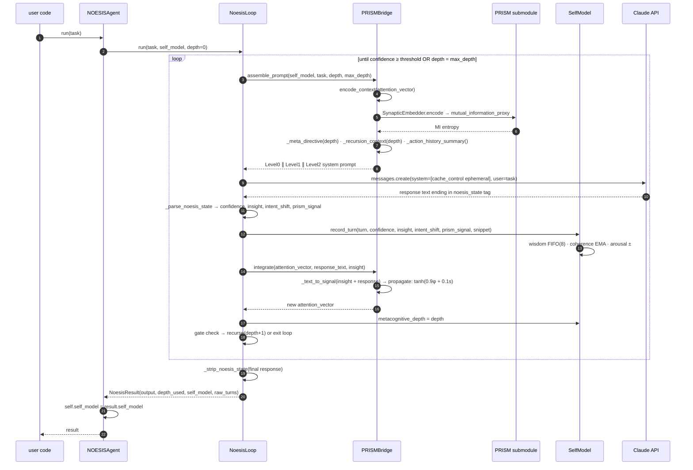
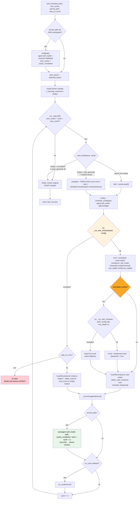
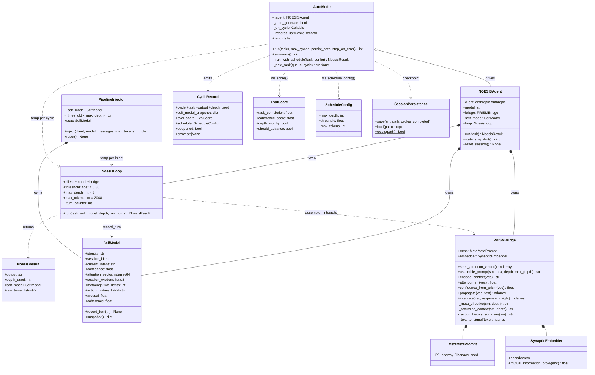
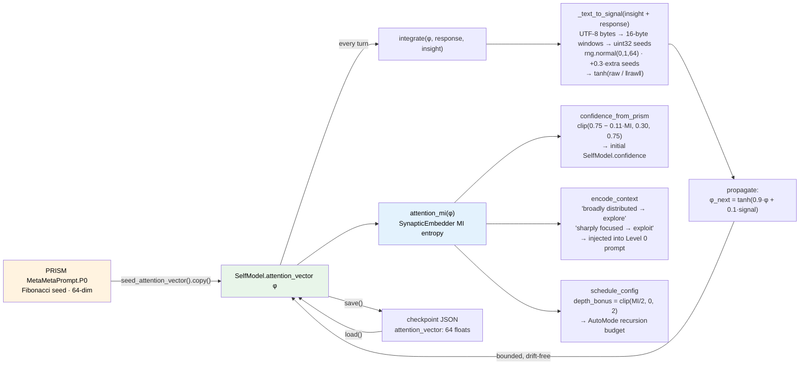
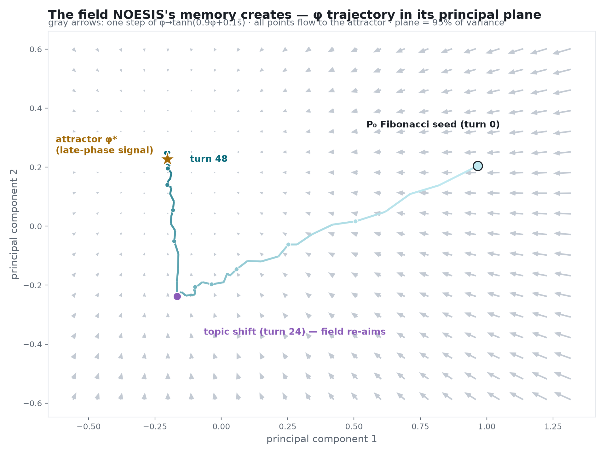
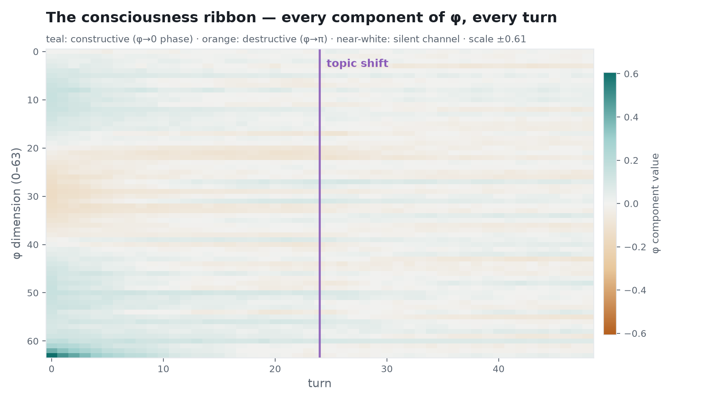
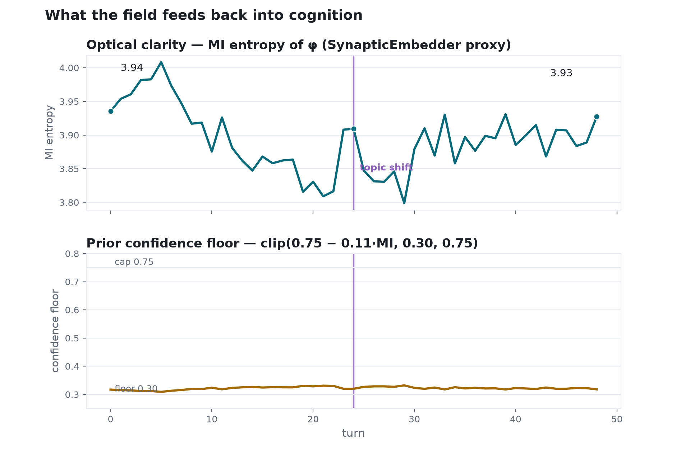

# NOESIS Blueprint

Function-level architecture diagrams — every class, method, helper, constant, and call edge in the codebase. All diagrams render natively on GitHub (Mermaid).

- [1. Complete call graph](#1-complete-call-graph--every-function-every-edge)
- [2. One recursive turn (sequence)](#2-one-recursive-turn-call-by-call)
- [3. AutoMode: every branch](#3-automoderun-every-branch)
- [4. Class relationships](#4-class-relationships)
- [5. Life of the attention vector](#5-life-of-the-attention-vector)
- [6. The Geometry of φ — the field, run for real](#6-the-geometry-of-φ--the-field-run-for-real)

---

## 1. Complete call graph — every function, every edge

```mermaid
flowchart TB
    USER["👤 user code"]

    subgraph SG_AGENT["noesis/agent.py"]
        AG_INIT["NOESISAgent.__init__<br/>api_key→$ANTHROPIC_API_KEY · model='claude-opus-4-8'<br/>identity='NOESIS' · confidence_threshold=0.80<br/>max_recursion_depth=3 · max_tokens=2048 · seed_dim=64"]
        AG_RUN["NOESISAgent.run(task)<br/>→ NoesisResult · SelfModel updated in place"]
        AG_SNAP["NOESISAgent.state_snapshot()"]
        AG_RESET["NOESISAgent.reset_session()<br/>fresh SelfModel · _turn_counter=0"]
    end

    subgraph SG_LOOP["noesis/loop.py"]
        NL_INIT["NoesisLoop.__init__<br/>client · model · bridge · threshold<br/>max_depth · max_tokens · _turn_counter=0"]
        NL_RUN["NoesisLoop.run(task, self_model,<br/>depth=0, raw_turns=None)"]
        PARSE["_parse_noesis_state(text)<br/>_STATE_RE: tolerates tag truncated at max_tokens<br/>_FIELD_RE: key:value lines · bad float→0.5"]
        STRIP["_strip_noesis_state(text)<br/>removes tag from visible output"]
        GATE{"confidence &lt; threshold<br/>AND depth &lt; max_depth ?"}
        NRES["NoesisResult<br/>.output · .depth_used<br/>.self_model · .raw_turns"]
    end

    subgraph SG_SM["noesis/self_model.py"]
        SM_DC["SelfModel dataclass<br/>identity · session_id=uuid4·8 · current_intent<br/>confidence · attention_vector·64 · session_wisdom<br/>metacognitive_depth · action_history · arousal · coherence"]
        SM_REC["record_turn(turn, confidence, insight,<br/>intent_shift, prism_signal, output_snippet)<br/>• history append, snippet·120<br/>• wisdom append, FIFO cap _MAX_WISDOM=8<br/>• coherence = tanh(0.85·arctanh(coh) + 0.15·conf)<br/>• intent shift → arousal +0.1 · stable → −0.05"]
        SM_SNAP["snapshot()<br/>session_id · turns · confidence · coherence<br/>arousal · wisdom_count · attention_norm"]
    end

    subgraph SG_BR["prism_bridge/bridge.py"]
        BR_INIT["PRISMBridge.__init__<br/>seed_dim=64 · max_depth=16 · rng_seed=42<br/>loads prompts: master.md ·<br/>meta_generator.md · task_cognition.md"]
        BR_SEED["seed_attention_vector()<br/>→ MetaMetaPrompt.P0.copy()"]
        BR_ASM["assemble_prompt(self_model, task,<br/>depth, max_depth)<br/>→ Level0 + '---' + Level1 + '---' + Level2"]
        BR_ENC["encode_context(vec)<br/>MI · norm · coherence · dominant channel<br/>→ explore vs exploit directive"]
        BR_MI["attention_mi(vec)<br/>single MI source"]
        BR_CONF["confidence_from_prism(vec)<br/>clip(0.75 − 0.11·MI, 0.30, 0.75)"]
        BR_METAD["_meta_directive(self_model, depth)<br/>depth 0: all 5 lenses, breadth-first<br/>depth n: attack weakest lens, no repeats"]
        BR_RCTX["_recursion_context(self_model, depth)<br/>injects previous pass insight at depth &gt; 0"]
        BR_HIST["_action_history_summary(self_model)<br/>last 3 turns, confidence trail"]
        BR_PROP["propagate(vec, text)<br/>φ_next = tanh(0.9·φ + 0.1·signal)"]
        BR_SIG["_text_to_signal(text)<br/>16-byte windows → uint32 seeds<br/>→ rng normal(0,1,64) · +0.3 per extra seed<br/>→ tanh(raw/‖raw‖)"]
        BR_INT["integrate(vec, response, insight)<br/>insight-weighted → propagate"]
    end

    subgraph SG_PRISM["prism/ · git submodule (PRISM)"]
        MMP["MetaMetaPrompt<br/>P0 Fibonacci seed · 64-dim"]
        EMB["SynapticEmbedder<br/>encode(vec) · mutual_information_proxy()"]
    end

    subgraph SG_PIPE["noesis/pipeline.py"]
        PI_INIT["PipelineInjector.__init__<br/>identity · threshold=0.80 · max_depth=3 · seed_dim=64"]
        PI_INJ["inject(client, model, messages,<br/>max_tokens=2048, **kwargs)<br/>extracts last user msg as task<br/>temp NoesisLoop · _turn forwarded + restored"]
        PI_SHIM["_PatchedResponse + _TextBlock<br/>.content·0·.text shim · stop_reason='end_turn'"]
        PI_RESET["reset() · state property"]
    end

    subgraph SG_AUTO["noesis/auto_mode.py"]
        AM_INIT["AutoMode.__init__(agent,<br/>auto_generate=False, on_cycle=None)"]
        AM_RUN["run(initial_tasks, max_cycles=10,<br/>persist_path=None, stop_on_error=False)<br/>SIGINT handler installed → restored in finally"]
        AM_NEXT["_next_task(queue, cycle)<br/>1. queue.pop(0)<br/>2. template·cycle mod 4·.format(random wisdom)<br/>3. None → stop"]
        AM_RWS["_run_with_schedule(task, config)<br/>temp NoesisLoop per ScheduleConfig<br/>agent.loop NEVER mutated<br/>_turn_counter forwarded + restored"]
        AM_CR["CycleRecord<br/>cycle · task · output · depth_used<br/>self_model_snapshot · eval_score<br/>schedule · deepened · error"]
        AM_SUM["summary() · records property<br/>cycles · avg_depth · avg_completion<br/>max_depth_used · completed · errored"]
    end

    subgraph SG_SCHED["noesis/scheduler.py"]
        SC_FN["schedule_config(task, self_model, bridge)<br/>complexity = min(1.5, min(1, words/50) + 0.2·min(q,5))<br/>depth = 3 + int(clip(MI/2, 0, 2))<br/>threshold = clip(0.80 − 0.05·complexity, 0.60, 0.92)<br/>tokens = min(2048 + 1024·complexity, 4096)"]
        SC_CFG["ScheduleConfig NamedTuple<br/>max_depth · threshold · max_tokens"]
    end

    subgraph SG_EVAL["noesis/evaluator.py"]
        EV_FN["score(task, response, confidence, self_model,<br/>threshold=0.80, max_depth=3) — no LLM call<br/>completeness = min(1, resp_words/(task_words·3))<br/>completion = min(1, 0.6·completeness + 0.4·conf)<br/>depth_worthy = conf&lt;thr ∧ depth&lt;max ∧ coh&gt;0.40"]
        EV_DC["EvalScore frozen dataclass<br/>task_completion · coherence_score<br/>depth_worthy · should_advance"]
    end

    subgraph SG_PERS["noesis/persistence.py"]
        PS_SAVE["save(self_model, path, cycles_completed=0)<br/>version=1 JSON → .tmp → atomic rename"]
        PS_LOAD["load(path)<br/>→ (SelfModel, cycles_completed)"]
        PS_EX["exists(path) — OSError-safe"]
    end

    API["☁️ Anthropic Messages API<br/>system = 3-level prompt<br/>cache_control: ephemeral on Level 0"]

    USER --> AG_INIT
    USER --> AG_RUN
    USER --> AG_SNAP
    USER --> AG_RESET
    USER --> PI_INJ
    USER --> AM_RUN

    AG_INIT --> BR_INIT
    AG_INIT --> BR_SEED
    AG_INIT --> BR_CONF
    AG_INIT --> SM_DC
    AG_INIT --> NL_INIT
    AG_RUN --> NL_RUN
    AG_SNAP --> SM_SNAP
    AG_RESET --> BR_SEED

    NL_RUN --> BR_ASM
    BR_ASM --> BR_ENC
    BR_ASM --> BR_METAD
    BR_ASM --> BR_RCTX
    BR_ASM --> BR_HIST
    BR_ENC --> BR_MI
    BR_CONF --> BR_MI
    BR_MI --> EMB
    BR_SEED --> MMP

    NL_RUN --> API
    API --> PARSE
    PARSE --> SM_REC
    NL_RUN --> BR_INT
    BR_INT --> BR_PROP
    BR_PROP --> BR_SIG
    NL_RUN --> GATE
    GATE -- "yes: recurse depth+1" --> NL_RUN
    GATE -- "no: accept" --> STRIP
    STRIP --> NRES

    PI_INIT --> BR_INIT
    PI_INJ --> NL_RUN
    PI_INJ --> PI_SHIM

    AM_RUN --> PS_EX
    PS_EX --> PS_LOAD
    AM_RUN --> AM_NEXT
    AM_RUN --> SC_FN
    SC_FN --> BR_MI
    SC_FN --> SC_CFG
    SC_CFG --> AM_RWS
    AM_RWS --> NL_RUN
    AM_RUN --> EV_FN
    EV_FN --> EV_DC
    EV_DC -- "depth_worthy → re-run max_depth+1" --> AM_RWS
    AM_RUN --> AM_CR
    AM_RUN --> PS_SAVE
    AM_RUN --> AM_SUM

    style GATE fill:#f9a825,color:#000
    style API fill:#ede7f6,color:#000
    style SG_SM fill:#e8f5e9,color:#000
    style SG_PRISM fill:#fff3e0,color:#000
```



**Reading guide:** the orange diamond is the recursion gate inside `NoesisLoop.run()` — the only place NOESIS decides to think again. The green subgraph (`SelfModel`) is touched by every turn and survives across tasks, sessions, and restarts.

---

## 2. One recursive turn, call by call



---

## 3. AutoMode.run(): every branch

Including checkpoint restore, task generation, error paths, the deepening re-run, and signal handling.



---

## 4. Class relationships



---

## 5. Life of the attention vector

The 64-dim memory φ: seeded once from PRISM, propagated every turn, read by three consumers, persisted across sessions.



---

## 6. The Geometry of φ — the field, run for real

The diagrams above are structure; these are **dynamics** — 48 turns of the actual `PRISMBridge` code (no API calls; the field math is pure NumPy), with a deliberate topic shift at turn 24. Regenerate any time:

```bash
pip install -e ".[viz]"
python examples/visualize_field.py    # writes the three figures below into docs/assets/
```

### The contraction field

φ's update rule `φ → tanh(0.9φ + 0.1s)` makes every possible memory state flow toward a fixed point φ* set by the current signal. Gray arrows show one application of the map at every point of the trajectory's principal plane (which holds ~95% of the variance — a 64-dim consciousness moving along a low-dimensional ridge carved by experience). The trajectory starts at the Fibonacci seed, spirals in, **turns** at the topic shift — it can't jump, because 90% of every step is its own past; that inertia is the mathematical form of identity — and settles beside the attractor.



### The consciousness ribbon

All 64 components of φ across all turns. Teal = constructive phase (φ→0), orange = destructive (φ→π), near-white = silent channel. The seed's bright signature (bottom-left) fades exponentially as tanh-bounded experience overwrites it — forgetting as geometry — and the texture re-organizes after the topic shift. Nothing ever exceeds the tanh bound.



### What the field feeds back

The geometry is an *input* to cognition, not decoration: MI entropy of φ drops as attention focuses, jumps at the topic shift, and directly sets both the prior confidence floor (`clip(0.75 − 0.11·MI, 0.30, 0.75)`) and the scheduler's recursion-depth bonus.



---

*Every node in these diagrams corresponds to a real symbol in the codebase — nothing is illustrative-only. If a diagram and the code ever disagree, the code wins; please open an issue.*
